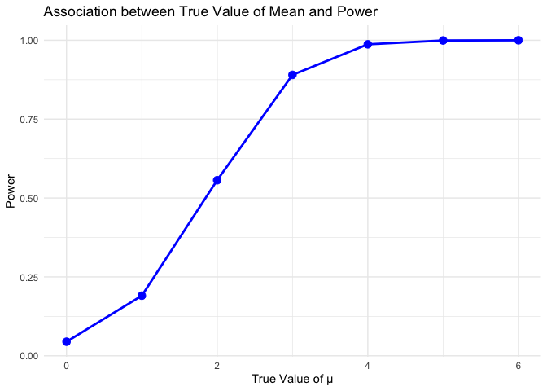

p8105_hw5_xh2636
================
Xiaoyu Huang
2023-11-10

``` r
library(tidyverse)
```

    ## ── Attaching core tidyverse packages ──────────────────────── tidyverse 2.0.0 ──
    ## ✔ dplyr     1.1.3     ✔ readr     2.1.4
    ## ✔ forcats   1.0.0     ✔ stringr   1.5.0
    ## ✔ ggplot2   3.4.3     ✔ tibble    3.2.1
    ## ✔ lubridate 1.9.2     ✔ tidyr     1.3.0
    ## ✔ purrr     1.0.2     
    ## ── Conflicts ────────────────────────────────────────── tidyverse_conflicts() ──
    ## ✖ dplyr::filter() masks stats::filter()
    ## ✖ dplyr::lag()    masks stats::lag()
    ## ℹ Use the conflicted package (<http://conflicted.r-lib.org/>) to force all conflicts to become errors

``` r
library(ggplot2)
library(dplyr)
library(rvest)
```

    ## 
    ## Attaching package: 'rvest'
    ## 
    ## The following object is masked from 'package:readr':
    ## 
    ##     guess_encoding

``` r
library(broom)
```

# Problem 1

``` r
# Load the raw data
path <- "https://raw.githubusercontent.com/washingtonpost/data-homicides/master/homicide-data.csv"

homicide_data <- read.csv(path)
```

The raw data is about 52179 criminal homicides over the past decade in
50 of the largest American cities with 12 columns. The data included the
location of the killing, whether an arrest was made and, in most cases,
basic demographic information about each victim.

``` r
# Adding the city state variable
homicide_data <- homicide_data %>%
  mutate(city_state = paste(city, state, sep = ", "))

# Summarize within cities, the total number of homicides and the number of unsolved homicides
city_summary <- homicide_data %>%
  group_by(city_state) %>%
  summarise(
    total_homicides = n(),
    unsolved_homicides = sum(disposition %in% c("Closed without arrest", 
                                                "Open/No arrest"))
  )
```

``` r
# Use the prop.test function to estimate the proportion of homicides that are unsolved
Baltimore_MD <- homicide_data %>%
  filter(city_state == "Baltimore, MD") %>%
  summarise(total_homicides = n(),
            unsolved_homicides = sum(disposition %in% c("Closed without arrest", 
                                                "Open/No arrest")))

# Apply the broom::tidy and pull the estimated proportion and confidence intervals
baltimore_test <- prop.test(x = pull(Baltimore_MD, unsolved_homicides)
                           , n = pull(Baltimore_MD, total_homicides)) %>%
  broom::tidy() %>%
  select(estimate, conf.low, conf.high)

baltimore_test %>% knitr::kable()
```

|  estimate |  conf.low | conf.high |
|----------:|----------:|----------:|
| 0.6455607 | 0.6275625 | 0.6631599 |

``` r
# Adding a function
prop_test_city <- function(city_all) {
  city_statesss <- city_all %>%
    summarise(total_homicides = n(), 
              unsolved_homicides = sum(disposition %in% c("Closed without arrest", 
                                                          "Open/No arrest")))

  city_test <- prop.test(x = pull(city_statesss, unsolved_homicides) , 
                       n = pull(city_statesss, total_homicides)) %>%
  broom::tidy() %>%
  select(estimate, conf.low, conf.high)
  
  city_test
}

# Apply function to nested dataset and un-nest results
result_df <- homicide_data %>%
  group_by(city_state) %>%
  nest() %>%
  mutate(result = map(data, prop_test_city)) %>%
  select(city_state, result) %>%
  unnest(cols = result)

print(result_df)
```

    ## # A tibble: 51 × 4
    ## # Groups:   city_state [51]
    ##    city_state      estimate conf.low conf.high
    ##    <chr>              <dbl>    <dbl>     <dbl>
    ##  1 Albuquerque, NM    0.386    0.337     0.438
    ##  2 Atlanta, GA        0.383    0.353     0.415
    ##  3 Baltimore, MD      0.646    0.628     0.663
    ##  4 Baton Rouge, LA    0.462    0.414     0.511
    ##  5 Birmingham, AL     0.434    0.399     0.469
    ##  6 Boston, MA         0.505    0.465     0.545
    ##  7 Buffalo, NY        0.612    0.569     0.654
    ##  8 Charlotte, NC      0.300    0.266     0.336
    ##  9 Chicago, IL        0.736    0.724     0.747
    ## 10 Cincinnati, OH     0.445    0.408     0.483
    ## # ℹ 41 more rows

``` r
# Arrange the city in estimate order and clean the dataframe
result_df <- result_df %>%
  filter(estimate != 0) %>%
  arrange(desc(estimate))

# Draw the graph
result_df %>%
  ggplot(aes(x = fct_reorder(city_state, -estimate), y = estimate)) +
  geom_point() +
  geom_errorbar(aes(ymin = conf.low, ymax = conf.high)) +
  coord_flip() +
  labs(title = "Proportion of Unsolved Homicides in Different Cities",
       x = "City",
       y = "Proportion of Unsolved Homicides") +
  theme_minimal() +
  theme(axis.text.x = element_text(angle = 45, hjust = 1))
```

<!-- -->

# Problem 2

``` r
# Find the folder path
folder_path <- "./data/"

# Get all CSV files in the folder using "list.files"
data_files <- list.files(folder_path, pattern = "\\.csv$", full.names = TRUE)

# Iterate over file names and read in data for each subject using purrr::map
all_data_csv <- map_df(data_files, ~{
  read.csv(.x) %>%
    mutate(subject_id = gsub("[^0-9]", "", basename(.x)),
           arm = ifelse(grepl("con", basename(.x)), "control", "experimental")) %>%
    gather(week, value, -subject_id, -arm) %>%
    mutate(week = as.numeric(gsub("\\D", "", week)))
})

view(all_data_csv)
```

``` r
# Make a spaghetti plot showing observations on each subject over time
spaghetti_plot <- ggplot(all_data_csv, aes(x = week, y = value, group = subject_id)) +
  geom_line() +
  facet_grid(~arm) +
  labs(title = "Value of Observations Over Time",
       x = "Week",
       y = "Value") +
  theme(legend.position = "top")

print(spaghetti_plot)
```

<!-- -->

As the graph, we can clearly see the different between control and
experimental arm. The mean value for control group is lower than
experimental, also same for the range of the value. Control arm have
more negative value compare to experimental. Lastly, the fluctuation of
the experimental curve is significantly greater than that of the
control.

# Problem 3

``` r
# Set seed for reproducibility
set.seed(123)

# Define parameters
n <- 30
sigma <- 5
true_mu <- c(0, 1, 2, 3, 4, 5, 6)
num_datasets <- 5000
alpha <- 0.05

# Create an empty dataframe to store results
results_df <- data.frame(mu_hat = numeric(),
                         p_value = numeric(),
                         true_mu = numeric(),
                         reject = logical(),
                         stringsAsFactors = FALSE)

# Generate datasets and perform t-tests
for (mu in true_mu) {
  for (i in 1:num_datasets) {
    dataset <- rnorm(n, mean = mu, sd = sigma)
    t_test_result <- tidy(t.test(dataset, mu = 0))
    mu_hat <- t_test_result$estimate
    p_value <- t_test_result$p.value
    reject <- p_value < alpha
    results_df <- rbind(results_df, c(mu_hat, p_value, mu, reject))
  }
}

# Rename columns
colnames(results_df) <- c("mu_hat", "p_value", "true_mu", "reject")
results_df$reject <- ifelse(results_df$reject, "TRUE", "FALSE")

print(head(results_df, 50))
```

    ##         mu_hat    p_value true_mu reject
    ## 1  -0.23551878 0.79442040       0  FALSE
    ## 2   0.89169168 0.25166939       0  FALSE
    ## 3   0.12210196 0.87884916       0  FALSE
    ## 4  -0.46944466 0.57503703       0  FALSE
    ## 5  -0.91790200 0.38848756       0  FALSE
    ## 6   0.76858322 0.37859641       0  FALSE
    ## 7   0.07353121 0.93421664       0  FALSE
    ## 8  -0.44824887 0.57831084       0  FALSE
    ## 9   0.25382524 0.78892441       0  FALSE
    ## 10  1.68345134 0.04827473       0   TRUE
    ## 11  0.34551969 0.71781302       0  FALSE
    ## 12 -0.55570178 0.60541478       0  FALSE
    ## 13  0.16700313 0.84091059       0  FALSE
    ## 14 -1.26707978 0.14515194       0  FALSE
    ## 15  0.15983845 0.87819444       0  FALSE
    ## 16  1.41151799 0.13174649       0  FALSE
    ## 17  0.17972766 0.83432233       0  FALSE
    ## 18  0.64221379 0.36010304       0  FALSE
    ## 19  0.32900890 0.70840790       0  FALSE
    ## 20 -0.95658039 0.32908702       0  FALSE
    ## 21 -0.93601091 0.35980535       0  FALSE
    ## 22 -0.51609459 0.54824067       0  FALSE
    ## 23 -1.20118621 0.19673566       0  FALSE
    ## 24  0.37587666 0.67430078       0  FALSE
    ## 25  1.55324772 0.17245331       0  FALSE
    ## 26  0.47767702 0.58821348       0  FALSE
    ## 27  0.23874757 0.77689576       0  FALSE
    ## 28 -1.46451995 0.12104588       0  FALSE
    ## 29  1.29053050 0.24837102       0  FALSE
    ## 30  1.01205084 0.25189588       0  FALSE
    ## 31  1.59361405 0.11783514       0  FALSE
    ## 32 -1.08462272 0.17990363       0  FALSE
    ## 33 -0.66448505 0.52514936       0  FALSE
    ## 34  0.67990044 0.54729458       0  FALSE
    ## 35  0.58318360 0.51149483       0  FALSE
    ## 36  0.44600731 0.53648518       0  FALSE
    ## 37 -0.34026795 0.72682166       0  FALSE
    ## 38  0.48472958 0.66094655       0  FALSE
    ## 39 -0.50851617 0.48682151       0  FALSE
    ## 40  0.16999486 0.85833365       0  FALSE
    ## 41 -1.23082689 0.17961281       0  FALSE
    ## 42  0.56647720 0.51962249       0  FALSE
    ## 43 -0.10980356 0.88953033       0  FALSE
    ## 44  0.25868819 0.74257553       0  FALSE
    ## 45 -0.89967821 0.41021871       0  FALSE
    ## 46  0.10729832 0.91134817       0  FALSE
    ## 47  0.26451587 0.75444240       0  FALSE
    ## 48  0.20115189 0.81779851       0  FALSE
    ## 49  1.07381309 0.20197413       0  FALSE
    ## 50  0.27234303 0.79301650       0  FALSE

``` r
# Create an empty dataframe to store additional results
additional_results_df <- data.frame(true_mu = numeric(),
                                    power = numeric(),
                                    average_mu_hat = numeric(),
                                    stringsAsFactors = FALSE)

# Calculate power and average_mu_hat
for (mu in true_mu) {
  # Subset the results dataframe for the current true_mu
  subset_df <- subset(results_df, true_mu == mu)
  power <- mean(subset_df$reject == TRUE)
  average_mu_hat <- mean(subset_df$mu_hat)
  additional_results_df <- rbind(additional_results_df, c(mu, power, average_mu_hat))
}

# Rename columns
colnames(additional_results_df) <- c("true_mu", "power", "average_mu_hat")
print(additional_results_df)
```

    ##   true_mu  power average_mu_hat
    ## 1       0 0.0446     0.00900112
    ## 2       1 0.1906     1.00965124
    ## 3       2 0.5564     1.99168819
    ## 4       3 0.8902     3.00976197
    ## 5       4 0.9872     3.97913690
    ## 6       5 0.9994     4.98439553
    ## 7       6 1.0000     5.98617606

``` r
# showing relation between power and true value of μ
ggplot(additional_results_df, aes(x = true_mu, y = power)) +
  geom_line(color = "blue", size = 1) +
  geom_point(color = "blue", size = 3) +
  labs(title = "Association between True Value of Mean and Power",
       x = "True Value of μ",
       y = "Power") +
  theme_minimal()
```

<!-- -->

From the graph we can see that the larger the true mean, the greater the
power, and they are directly proportional. It shows that as the effect
size increases, the proportion of times the null was rejected (the power
of the test) also increases.
